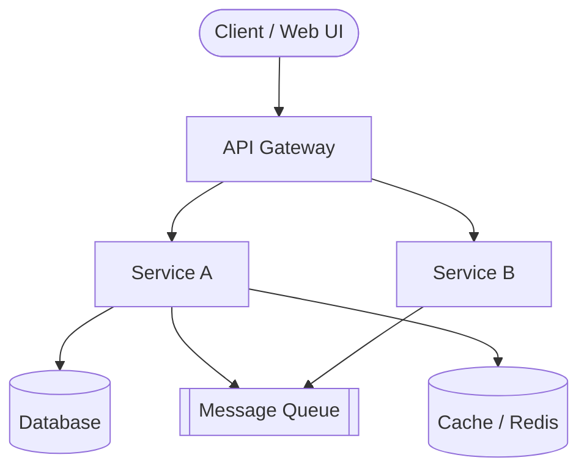
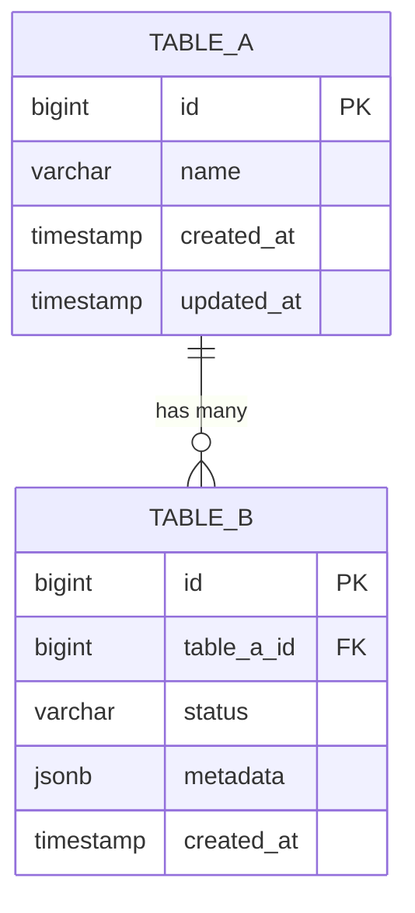
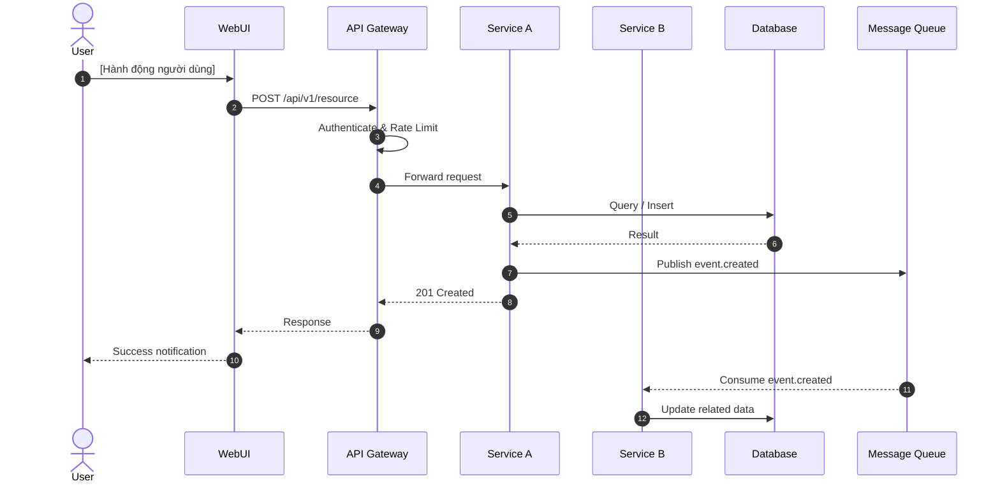
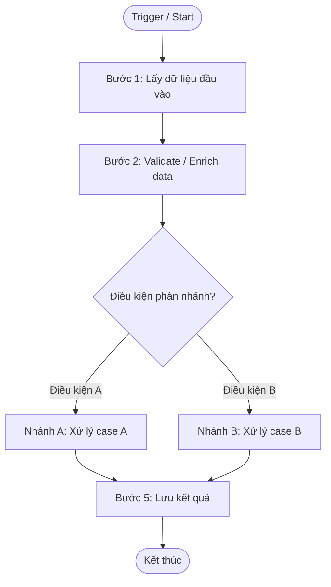
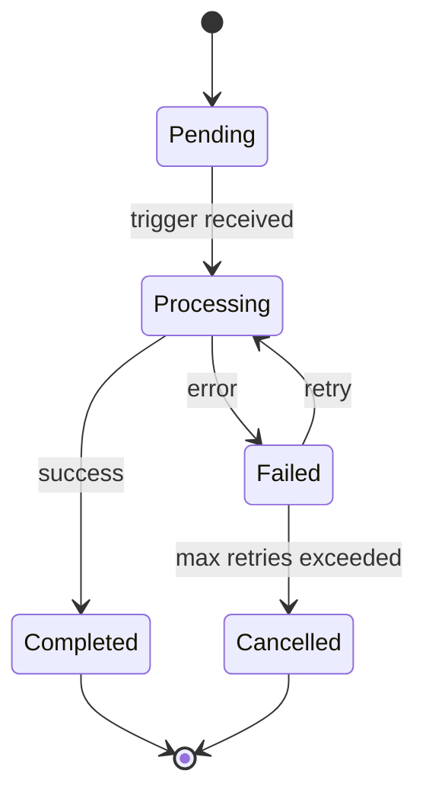
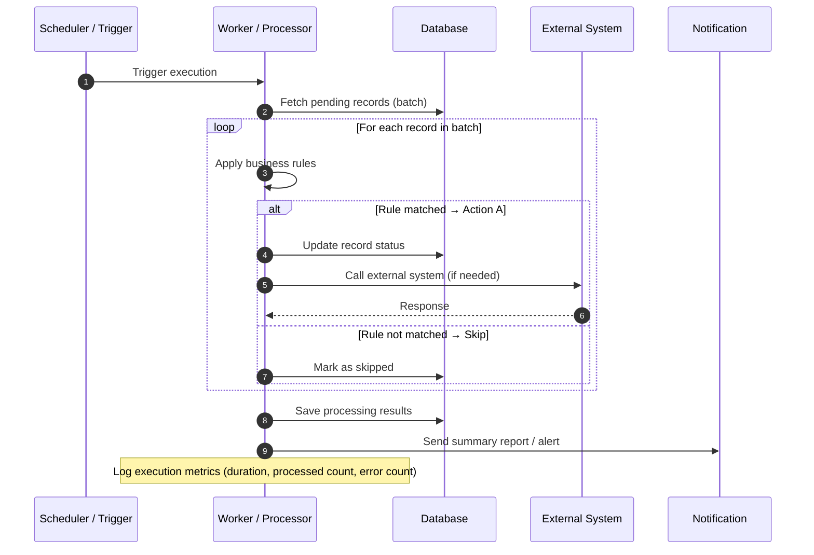

# Solution Design: [Tên Tính Năng / Feature Name]

{/* Hướng dẫn sử dụng: Xóa các chú thích trước khi publish tài liệu */}

{/*
  ⚠️ MDX / Docusaurus Compatibility Notes:
  - File này dùng JSX comments thay vì HTML comments để tương thích MDX/Docusaurus
  - KHÔNG dùng HTML comments trong .mdx files — sẽ gây build error trên Docusaurus
  - Trong mermaid code blocks thì vẫn dùng syntax bình thường (không bị ảnh hưởng bởi MDX parser)
  - Tránh dùng ký tự đặc biệt JSX ngoài code blocks: < > { } — nếu cần thì escape: {'<'} {'>'}  {'{'} {'}'}
  - Nếu cần dùng biểu thức chứa dấu < > ngoài code block (ví dụ: generic types), wrap trong backticks: `Map<String, Object>`
  - Checkbox syntax `- [ ]` và `- [x]` hoạt động bình thường trong Docusaurus MDX
*/}

---

## Revision History

| Version | Date       | Author | Changes                    |
|---------|------------|--------|----------------------------|
| 1.0.0   | YYYY-MM-DD | [Tên]  | Initial draft              |
| 1.1.0   | YYYY-MM-DD | [Tên]  | Updated after review       |

---

> **Numbering has deliberate gaps.** Sections 4, 8, 11 and 14 were removed after
> measuring 34 shipped SDs (Stakeholders 1/34; Message Queue, Security
> Considerations and Risks & Mitigations 0/34 each). The survivors KEEP their
> original numbers: §X.Y is a stable identifier referenced 337 times inside
> spec-flow and 1,496 times across already-shipped SDs, and the number-based
> cross-checks in `lib/trace.cjs` (§5.1, §5.2, §10.4, §12.2, §13.2) key on them.
> Renumbering would buy tidiness and cost 1,833 references. Do not renumber.

## 1. Overview

{/* Tóm tắt ngắn gọn (3-5 câu) về tính năng / thay đổi này. Trả lời câu hỏi: Đây là gì? Tại sao cần làm? Ai sẽ dùng? */}

**Loại thay đổi:** `New Feature` | `Enhancement` | `Change Request` | `Bug Fix` | `Technical Debt`

**Loại thiết kế:** `API Service` | `Internal Process` | `Hybrid`

{/*
  - API Service: Tính năng expose API cho client / service khác consume
  - Internal Process: Logic xử lý nội bộ (batch job, scheduler, data pipeline, rule engine, state machine, background worker, v.v.)
  - Hybrid: Kết hợp cả API lẫn internal processing

  Tùy loại thiết kế, giữ / xóa Part phù hợp:
  - API Service → Giữ Part B, bỏ Part C
  - Internal Process → Giữ Part C, bỏ Part B
  - Hybrid → Giữ cả Part B + Part C
*/}

**Phạm vi ảnh hưởng:** `Frontend` | `Backend` | `Database` | `Infrastructure` | `Third-party Integration`

**Epic / Ticket:** [JIRA-XXXX](https://jira.example.com/browse/XXXX)

> **Tóm tắt:** [Mô tả ngắn gọn tính năng hoặc thay đổi cần thiết kế]

---

## 2. Background & Problem Statement

### 2.1 Bối cảnh (Context)

{/* Mô tả tình trạng hiện tại (As-Is). Hệ thống đang hoạt động như thế nào? */}

[Mô tả hệ thống / quy trình hiện tại]

### 2.2 Vấn đề (Problem Statement)

{/* Vấn đề cụ thể cần giải quyết là gì? Pain point của user/business là gì? */}

[Mô tả vấn đề đang gặp phải]

### 2.3 Giải pháp đề xuất (Proposed Solution)

{/* Tóm tắt cấp cao giải pháp sẽ làm (To-Be). Chi tiết ở các section sau */}

[Mô tả giải pháp ở mức high-level]

---

## 3. Goals & Non-Goals

### 3.1 Goals (Trong phạm vi)

- [Mục tiêu 1 — cụ thể, đo lường được]
- [Mục tiêu 2]
- [Mục tiêu 3]

### 3.2 Non-Goals (Ngoài phạm vi)

{/* Quan trọng: Xác định rõ những gì KHÔNG làm trong phiên bản này */}

- [Không làm: ví dụ "Không hỗ trợ multi-tenant trong phase này"]
- [Không làm: ...]

### 3.3 Success Criteria

{/* Làm thế nào để biết giải pháp này thành công? */}

| Criterion               | Target         | Measurement Method  |
|-------------------------|----------------|---------------------|
| [Tiêu chí 1]            | [Giá trị]      | [Cách đo]           |
| [Tiêu chí 2]            | [Giá trị]      | [Cách đo]           |

---

## 5. Requirements

### 5.1 Functional Requirements

> **Table cells:** escape a literal `|` inside a cell as `\|` (markdown only — it keeps the row's column count so `route` / `trace-build` read the right cells). The value it denotes is the plain `|` character (U+007C): write `|`, never `\|`, in code, config, or payloads.

| ID     | Requirement                                              | Priority        |
|--------|----------------------------------------------------------|-----------------|
| FR-001 | [Mô tả yêu cầu chức năng 1]                              | Must Have       |
| FR-002 | [Mô tả yêu cầu chức năng 2]                              | Should Have     |
| FR-003 | [Mô tả yêu cầu chức năng 3]                              | Nice to Have    |

> Priority: `Must Have` | `Should Have` | `Nice to Have` (MoSCoW)

### 5.2 Non-Functional Requirements

| ID      | Category        | Requirement                                              | Target              |
|---------|-----------------|----------------------------------------------------------|---------------------|
| NFR-001 | Performance     | API response time (P95)                                  | < 200ms             |
| NFR-002 | Availability    | Service uptime                                           | 99.9%               |
| NFR-003 | Scalability     | Throughput                                               | [X] req/s           |
| NFR-004 | Security        | [Authentication / Authorization requirement]             | [Standard]          |
| NFR-005 | Data Retention  | [Chính sách lưu trữ dữ liệu]                             | [X] ngày/tháng      |

---

## 6. Architecture Overview

### 6.1 High-Level Architecture

{/* Diagram tổng quan hệ thống — dùng Mermaid */}



### 6.2 Component Description

| Component     | Technology      | Responsibility                              |
|---------------|-----------------|---------------------------------------------|
| API Gateway   | [Kong / Nginx]  | Rate limiting, routing, auth                |
| Service A     | [NestJS / Go]   | [Mô tả trách nhiệm]                         |
| Service B     | [Spring Boot]   | [Mô tả trách nhiệm]                         |
| Database      | [PostgreSQL]    | [Mô tả dữ liệu lưu trữ]                    |
| Cache         | [Redis]         | [Session / computed data caching]           |
| Message Queue | [Kafka / RMQ]   | [Async event processing]                    |

### 6.3 Các Thay Đổi So Với Hiện Tại

{/* Mô tả delta — những gì THAY ĐỔI so với hệ thống hiện tại */}

- **Thêm mới:** [Component / service mới]
- **Thay đổi:** [Component / service có thay đổi]
- **Xóa bỏ:** [Component / service deprecated]

---

## 7. Data Model

{/* Nếu không có thay đổi database → XÓA toàn bộ section này */}

### 7.1 ERD Diagram



### 7.2 Table Definitions

#### `table_name` (New / Modified)

| Column        | Type          | Nullable | Default | Description                    |
|---------------|---------------|----------|---------|--------------------------------|
| `id`          | `BIGINT`      | NO       | auto    | Primary key                    |
| `column_name` | `VARCHAR(255)`| NO       | —       | [Mô tả cột]                    |
| `status`      | `VARCHAR(50)` | NO       | —       | Enum: `active`, `inactive`     |
| `metadata`    | `JSONB`       | YES      | `{}`    | [Mô tả dữ liệu JSON]           |
| `created_at`  | `TIMESTAMP`   | NO       | NOW()   | Thời điểm tạo record           |
| `updated_at`  | `TIMESTAMP`   | NO       | NOW()   | Thời điểm cập nhật cuối        |

### 7.3 Index Design

{/* Tách riêng index design per table — dễ review và không bị lẫn với table definition */}

#### `table_name`

| Index Name                  | Columns                     | Type        | Purpose                                 |
|-----------------------------|-----------------------------|-------------|-----------------------------------------|
| `table_name_pkey`           | `id`                        | PRIMARY KEY | PK                                      |
| `table_name_status_idx`     | `status`                    | B-TREE      | Filter by status                        |
| `table_name_composite_idx`  | `(tenant_id, created_at)`   | B-TREE      | [Mô tả mục đích composite index]        |

### 7.4 Data Migration Plan

{/* Nếu có thay đổi schema cần migrate data. Chỉ mô tả bằng text, KHÔNG viết SQL migration script */}

| Migration | Mô tả                              | Seed Data                          |
|-----------|-------------------------------------|------------------------------------|
| **V[N]**  | [Tạo table / Alter column / ...]    | [Mô tả seed data nếu có]           |
| **V[N+1]**| [Migration tiếp theo]               | [Không có seed data]               |

{/* Nếu có seed data quan trọng, mô tả chi tiết trong bảng riêng: */}

**Seed data `table_name` (nếu có):**

| # | Column A   | Column B       | Column C    | Ghi chú        |
|---|------------|----------------|-------------|----------------|
| 1 | [Giá trị]  | [Giá trị]      | [Giá trị]   | [Ghi chú]      |
| 2 | [Giá trị]  | [Giá trị]      | [Giá trị]   | [Ghi chú]      |

**Migration strategy:** `Online Migration` | `Offline Migration` | `Blue-Green`

**Estimated downtime:** [X phút / Zero downtime]

**Rollback plan:** [Mô tả cách rollback nếu migration thất bại]

---

## 9. API Design

{/* Nếu loại thiết kế là "Internal Process" → XÓA toàn bộ Part B (section này) */}

### 9.1 Overview & Authentication

- **Base URL:** `https://api.example.com`
- **Version:** `v1`
- **Authentication:** `Bearer Token (JWT)` | `API Key` | `OAuth 2.0`

{/* Nếu có nhiều nhóm API (public + backoffice), mô tả tổng quan ở đây */}

| API Group    | Base Path             | Auth                | Role              |
|--------------|-----------------------|---------------------|-------------------|
| Public API   | `/api/v1/...`         | JWT (end-user)      | `user`            |
| Backoffice   | `/bo/api/v1/...`      | JWT (admin)         | `admin`, `viewer` |

### 9.2 API Endpoints

{/* Mô tả chi tiết từng API endpoint mới hoặc thay đổi */}

---

#### `POST /api/v1/{resource}`

**Mô tả:** [Mô tả chức năng của API này]

**Authorization:** `Required` — Role: `[user / admin / service]`

**Headers:**

| Header          | Required | Value                        |
|-----------------|----------|------------------------------|
| `Authorization` | Yes      | `Bearer {access_token}`      |
| `Content-Type`  | Yes      | `application/json`           |
| `X-Request-ID`  | No       | UUID để trace request        |

**Request Body:**

```json
{
  "field1": "string",
  "field2": 123,
  "field3": {
    "nestedField": "value"
  }
}
```

| Field       | Type     | Required | Validation             | Description         |
|-------------|----------|----------|------------------------|---------------------|
| `field1`    | `string` | Yes      | maxLength: 255         | [Mô tả]             |
| `field2`    | `integer`| Yes      | min: 1, max: 9999      | [Mô tả]             |
| `field3`    | `object` | No       | —                      | [Mô tả]             |

**Response — 201 Created:**

```json
{
  "success": true,
  "data": {
    "id": 456,
    "field1": "string",
    "createdAt": "2024-01-01T00:00:00Z"
  },
  "message": "Resource created successfully"
}
```

---

> **One worked endpoint above is the pattern; repeat that shape per endpoint.**
> The full CRUD catalogue (GET one, GET list, PUT, DELETE) used to be spelled out
> here and cost ~80 template lines that sd-author read on every ingest without
> learning anything new from instances 2-5. Document only the endpoints this
> feature actually exposes, each with: path + auth, request schema, response
> schema, and the error codes it can return (cross-referenced to §12.2).

### 9.3 Common Error Responses

| HTTP Status | Error Code              | Description                         |
|-------------|-------------------------|-------------------------------------|
| `400`       | `VALIDATION_ERROR`      | Request body không hợp lệ           |
| `401`       | `UNAUTHORIZED`          | Token không hợp lệ hoặc hết hạn     |
| `403`       | `FORBIDDEN`             | Không có quyền thực hiện            |
| `404`       | `NOT_FOUND`             | Resource không tồn tại              |
| `409`       | `RESOURCE_CONFLICT`     | Resource đã tồn tại / version conflict |
| `500`       | `INTERNAL_SERVER_ERROR` | Lỗi server                          |

**Error Response Format:**

```json
{
  "success": false,
  "error": {
    "code": "VALIDATION_ERROR",
    "message": "Invalid request body",
    "details": [
      { "field": "field1", "message": "field1 is required" }
    ]
  },
  "requestId": "uuid-v4"
}
```

### 9.4 Sequence Diagrams

{/* Sequence diagrams nằm cùng section API Design để flow liền mạch: endpoint → logic → response */}

#### 9.4.1 [Flow 1: Tên Luồng Chính]

{/* Ví dụ: User tạo đơn hàng */}



> One sequence diagram is the pattern. Add one per non-trivial flow this feature introduces — do not diagram CRUD.

## 10. Internal Process Design

{/* Nếu loại thiết kế là "API Service" → XÓA toàn bộ Part C (section này) */}
{/* Mô tả chi tiết logic xử lý nội bộ: batch job, scheduler, data pipeline, rule engine, state machine, background worker, v.v. */}

### 10.1 Process Overview

**Loại process:** `Scheduled Job` | `Event-Driven Worker` | `Data Pipeline` | `Rule Engine` | `State Machine` | `Background Task` | `Other`

**Trigger:** `Cron Schedule` | `Event / Message` | `Manual` | `System Event` | `Condition-Based`

**Execution Mode:** `Synchronous` | `Asynchronous` | `Streaming`

> **Tóm tắt:** [Mô tả ngắn gọn process này làm gì, input → processing → output]

### 10.2 Process Flow

{/* Mô tả luồng xử lý chính bằng flowchart hoặc ASCII pipeline diagram */}

```
┌─────────────────────────────────────────────────────────────────────┐
│                        PROCESSING PIPELINE                          │
│                                                                     │
│  ┌──────────┐   ┌──────────────┐   ┌────────────┐   ┌───────────┐ │
│  │ 1. LOAD  │──►│ 2. VALIDATE  │──►│ 3. PROCESS │──►│ 4. OUTPUT │ │
│  │ INPUT    │   │ & ENRICH     │   │ & APPLY    │   │ & NOTIFY  │ │
│  └──────────┘   └──────────────┘   └────────────┘   └───────────┘ │
│       │               │                  │                │        │
│  [Data source]   [Validation rules] [Business logic] [Persist +   │
│                                                       notify]     │
└─────────────────────────────────────────────────────────────────────┘
```

{/* Hoặc dùng mermaid flowchart cho luồng chi tiết hơn: */}



### 10.3 Processing Rules & Business Logic

{/* Mô tả chi tiết các rules / logic xử lý. Nếu logic phức tạp, dùng pseudocode + decision table */}

| Rule ID | Tên Rule               | Điều kiện (Condition)                      | Hành động (Action)                         | Ưu tiên |
|---------|------------------------|--------------------------------------------|--------------------------------------------|---------|
| RL-001  | [Tên rule 1]           | [Điều kiện kích hoạt]                       | [Hành động thực hiện]                       | 1       |
| RL-002  | [Tên rule 2]           | [Điều kiện kích hoạt]                       | [Hành động thực hiện]                       | 2       |
| RL-003  | [Tên rule 3]           | [Điều kiện kích hoạt]                       | [Hành động thực hiện]                       | 3       |

**Decision Table (nếu cần):**

| Condition A | Condition B | Condition C | Action          |
|-------------|-------------|-------------|-----------------|
| True        | True        | *           | [Hành động 1]   |
| True        | False       | True        | [Hành động 2]   |
| False       | *           | *           | [Hành động 3]   |

**Pseudocode (nếu cần):**

```
for item in input:
    if condition_A(item):
        action_A(item)
    else if condition_B(item):
        action_B(item)
    else:
        skip(item)
```

### 10.4 State Management

{/* Nếu process có quản lý state / trạng thái → Mô tả state machine. Nếu không → Xóa sub-section này */}



| State        | Meaning                          | Allowed Transitions           | Entry Action                      |
|--------------|----------------------------------|-------------------------------|-----------------------------------|
| `Pending`    | Chờ xử lý                       | → Processing                  | —                                 |
| `Processing` | Đang xử lý                      | → Completed, → Failed         | Lock resource, start processing   |
| `Completed`  | Hoàn thành                       | —                             | Release resource, emit event      |
| `Failed`     | Lỗi                             | → Processing, → Cancelled     | Log error, notify                 |
| `Cancelled`  | Hủy                             | —                             | Cleanup, alert on-call            |

### 10.5 Scheduling & Execution Configuration

{/* Nếu process là scheduled/recurring → Điền bảng này. Nếu không → Xóa sub-section này */}

| Parameter               | Value                    | Mô tả                                             |
|-------------------------|--------------------------|----------------------------------------------------|
| **Schedule**            | `cron: 0 2 * * *`       | [Ví dụ: Chạy lúc 2:00 AM hàng ngày]               |
| **Timeout**             | [X phút / giờ]           | Thời gian tối đa cho mỗi lần chạy                  |
| **Concurrency**         | [1 / N instances]        | Cho phép chạy đồng thời bao nhiêu instance          |
| **Batch Size**          | [N records / batch]      | Số lượng records xử lý mỗi batch                    |
| **Idempotency**         | Yes / No                 | Process có idempotent không? Chạy lại có an toàn?    |
| **Distributed Lock**    | [Có / Không]             | Cơ chế lock khi chạy multi-instance                 |
| **Dead Letter Handling**| [Strategy]               | Xử lý message / record lỗi sau max retries          |

### 10.6 Input / Output Specification

**Input:**

| Source                 | Loại                    | Mô tả                                      | Volume ước tính         |
|------------------------|-------------------------|---------------------------------------------|-------------------------|
| [Database / Table X]   | Query result            | [Mô tả dữ liệu đầu vào]                    | [X records / lần chạy]  |
| [Message Queue / Topic]| Event message           | [Mô tả event trigger]                       | [X msg / phút]          |
| [External System / API]| API response            | [Mô tả dữ liệu từ hệ thống ngoài]          | [X requests / lần chạy] |

**Output:**

| Destination            | Loại                    | Mô tả                                      | Side Effects            |
|------------------------|-------------------------|---------------------------------------------|-------------------------|
| [Database / Table Y]   | Insert / Update         | [Mô tả dữ liệu output]                     | [Mô tả ảnh hưởng]       |
| [Message Queue / Topic]| Published event         | [Mô tả event phát ra]                       | [Downstream consumers]  |
| [Notification / Alert] | Email / Slack / Webhook | [Mô tả thông báo gửi đi]                    | —                       |

### 10.7 Observability & Monitoring

{/* Mô tả cách monitor process: metrics, alerts, dashboard */}

| Metric / Alert              | Điều kiện                             | Action                          |
|-----------------------------|---------------------------------------|---------------------------------|
| Process execution time      | > [X] phút                            | Warning alert                   |
| Failure rate                | > [X]% trong [Y] phút                 | Critical alert, page on-call    |
| Records processed           | Giảm > [X]% so với trung bình         | Warning alert                   |
| Queue lag / backlog          | > [X] messages pending                | Scale up consumers              |

### 10.8 Sequence Diagrams

{/* Sequence diagrams nằm cùng section Internal Process để flow liền mạch: trigger → processing → output */}

#### 10.8.1 [Flow 1: Main Processing Flow]



> One sequence diagram is the pattern. Add one per non-trivial internal flow — scheduler tick, retry/compensation, state transition.

## 12. Error Handling & Resilience

### 12.1 Error Classification

{/*
  Chọn bảng phù hợp với loại thiết kế. Hybrid giữ cả hai.
  Nếu có error codes riêng cho domain, thêm sub-section "Domain Error Codes" với bảng chi tiết.
*/}

**Cho API Service:**

| Category        | Example                          | Strategy                        |
|-----------------|----------------------------------|---------------------------------|
| Client Error    | Invalid input, Not found         | Return 4xx, không retry         |
| Transient Error | Timeout, DB connection           | Retry với exponential backoff   |
| Business Error  | Insufficient balance             | Return 422 + business error code|
| System Error    | Unhandled exception              | Return 500, alert on-call       |

**Cho Internal Process:**

| Category            | Example                               | Strategy                                          |
|---------------------|---------------------------------------|---------------------------------------------------|
| Data Validation     | Record thiếu field bắt buộc           | Skip record, log warning, tiếp tục batch          |
| Transient Error     | DB timeout, external API unavailable  | Retry record với backoff, mark failed sau max retry|
| Business Rule Error | Record vi phạm business rule          | Mark as rejected, log reason, notify nếu cần      |
| Partial Failure     | Một số records trong batch bị lỗi     | Commit thành công, retry/DLQ records lỗi          |
| Fatal Error         | Config sai, dependency không khởi tạo | Abort toàn bộ execution, alert on-call ngay       |

### 12.2 Domain Error Codes

{/* Nếu có error codes riêng cho domain (business errors), liệt kê chi tiết ở đây. Nếu không → Xóa sub-section này */}

| Error Code              | Trigger              | HTTP | Description                         |
|-------------------------|----------------------|------|-------------------------------------|
| `[DOMAIN_ERROR_001]`    | [Rule / Condition]   | 422  | [Mô tả lỗi cụ thể]                 |
| `[DOMAIN_ERROR_002]`    | [Rule / Condition]   | 422  | [Mô tả lỗi cụ thể]                 |

**Error Response Example:**

```json
{
  "success": false,
  "error": {
    "code": "DOMAIN_ERROR_001",
    "message": "[Mô tả lỗi cho end-user]",
    "details": {
      "violatedRule": "[rule name]",
      "currentValue": 123,
      "limitValue": 100
    }
  }
}
```

### 12.3 Retry Policy

| Operation              | Max Retries | Backoff Strategy         | DLQ             |
|------------------------|-------------|--------------------------|-----------------|
| DB write               | 3           | Exponential (1s, 2s, 4s) | No              |
| External API call      | 3           | Exponential + jitter     | No              |
| Message queue consumer | 5           | Exponential (5s, 15s...) | Yes, after 5x   |

### 12.4 Circuit Breaker

{/* Áp dụng Circuit Breaker cho các external dependency. Nếu không có → Xóa sub-section này */}

| Dependency      | Threshold  | Timeout   | Half-Open Probe    |
|-----------------|------------|-----------|--------------------|
| Service B       | 50% / 10s  | 5s        | 1 req / 30s        |
| External API    | 30% / 5s   | 3s        | 1 req / 60s        |

### 12.5 Fallback Strategy

- [Dependency A] — Fallback: [Mô tả behavior khi dependency down]
- [Dependency B] — Fallback: [Mô tả behavior]

---

## 13. Testing Strategy

### 13.1 Test Coverage Requirements

| Layer              | Type             | Coverage Target | Tool               |
|--------------------|------------------|-----------------|--------------------|
| Unit Tests         | Business logic   | ≥ 80%           | Jest / JUnit       |
| Integration Tests  | API endpoints    | Critical paths  | Supertest / RestAssured |
| E2E Tests          | Critical flows   | Happy paths     | Playwright / Cypress|
| Load Tests         | Performance      | NFR targets     | k6 / JMeter        |
| Security Tests     | OWASP Top 10     | —               | OWASP ZAP          |

### 13.2 Test Cases (Critical)

{/* Liệt kê test cases quan trọng. Nhóm theo flow / concern. */}

| ID     | Flow                        | Test Case                               | Expected Result               |
|--------|-----------------------------|-----------------------------------------|-------------------------------|
| TC-001 | [Flow chính]                | Happy path — valid input                | [Expected]                    |
| TC-002 | [Flow chính]                | Validation error                        | [Expected]                    |
| TC-003 | [Business rule]             | [Rule X triggered]                      | [Expected]                    |
| TC-004 | [Edge case]                 | [Mô tả edge case]                       | [Expected]                    |
| TC-005 | [Concurrency]               | Multiple concurrent requests            | No data corruption            |
| TC-006 | [Failure / Recovery]        | [Dependency down / crash mid-process]   | [Expected recovery behavior]  |
| TC-007 | [Idempotency]               | Same request twice                      | No duplicate side effects     |

---

## 15. Open Questions

{/* Các câu hỏi chưa có quyết định, cần làm rõ trước khi implement */}

| ID   | Question                                           | Status     | Decision By | Decision              |
|------|----------------------------------------------------|------------|-------------|------------------------|
| Q-01 | [Câu hỏi cần làm rõ 1]                            | Open       | [Owner]     | —                      |
| Q-02 | [Câu hỏi cần làm rõ 2]                            | Resolved   | [Owner]     | [Quyết định đã chọn]  |
| Q-03 | [Câu hỏi về business rule]                        | Open       | [Product]   | —                      |

---

{/* Không mention code và internal files */}

## Appendix: Glossary

| Term     | Definition          |
|----------|---------------------|
| [Term 1] | [Định nghĩa]        |
| [Term 2] | [Định nghĩa]        |

---

*Document maintained by [Team Name]. For questions, contact [email/Slack channel].*
